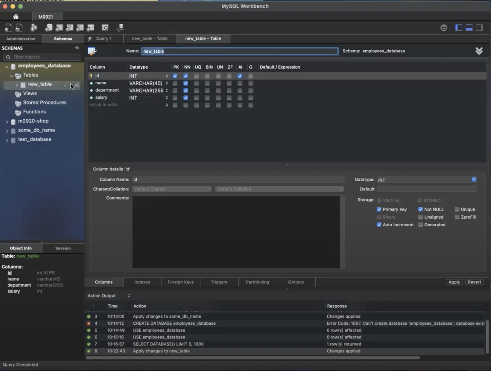

<!-- Persist data
How to get persist data -->

# Persist data


### Know the basics
what is data? 
In simple words data can be facts related to any object in consideration.

For example;

- Your name, age, height, weight etc. are data related to you.
- A picture, image, video, audio, text, document, file, etc. are data related to any object.

What is a database?

Database us a systematic collection of data. It is a collection of data that is organized in such a way that a computer program can quickly select desired pieces of data.

Database make data management easy to use.

An online telephone directory is a database. It contains the names and addresses of people, and the telephone numbers associated with those people. The database is organized so that a computer program can quickly select the name and address of a person when given the person's telephone number.

Your electric service provider is obviously using a database to manage billing, client related issues, to handle fault data, etc.

Lets also consider Facebook, It is a social networking site. It is a database that contains the names, addresses, telephone numbers, and other information about people. It also contains the names, addresses, telephone numbers, and other information about people's friends. The database is organized so that a computer program can quickly select the name and address of a person's friends when given the person's name.

### What is a database management system?

A database management system (DBMS) is a software that allows you to store, organize, and retrieve data in a database. It is a collection of programs that enables you to define, create, maintain, and control access to a database.

It also helps to control access to the database.

Database Management Systems are not a new concept. They have been around for a long time. The first database management system was created in 1960. It was called the IBM System R. It was a relational database management system. It was used to manage data in a relational database.


Charles Bachman and Raymond Boyce created the first commercial database management system in 1970. It was called the IBM System R/1. It was a relational database management system. It was used to manage data in a relational database.

### Types of DBMS

- Hierarchical DBMS
- Network DBMS
- Relational DBMS * (most popular) (RDBMS)
- Object-oriented Relation DBMS

### What is SQL?

SQL stands for Structured Query Language. It is a language used to communicate with a database. It is used to perform tasks such as update data on a database, or retrieve data from a database.

See-Q-L is pronounced as "sequel".

SQL programming can be effectively used to insert, search, update and delete data in a database.

That doesn't mean SQL cannot do things beyond that, In fact it can do lot of things including, but not limited to, optimizing and maintenance of database.

Relation databases like MySQL, Oracle, SQL Server, etc. use SQL as their standard database language.

Sql Example,

```sql
SELECT * FROM table_name;

SELECT * FROM Members WHERE age > 30;
```

- `SELECT` is a keyword that tells the database management system to retrieve data from the database.

-`*` is a wildcard character that tells the database management system to retrieve all columns from the table.

- `FROM` is a keyword that tells the database management system which table to select data from.

- `WHERE` is a keyword that tells the database management system to filter the data.

- `age` is the name of the column that you want to filter the data by.

- `> 30` is the value that you want to filter the data by.

- `Members` is Paramaters/Data passed to the query.

SQL is not key sensitive, but it is good practice to write SQL keywords in uppercase.

### What is normalization?

Normalization is a database design technique which organizes tables in a manner that reduces redundancy and dependency of data.

In divides larger tables to smaller tables and links them using relationships.

The inventor of the relational model, Edgar Codd, proposed the theory of normalization with the introduction of First Normal Form, and he continued to extend theory with Second and Third Normal Form.

### Database Normalization Example

Assume a video library maintains a database of movies rented out. Without any normalization, all information is stored in one table as shown below.

Here you see Movies Rented column has multiple values separated by commas. This is not a good design because it violates the first normal form.


First Normal Form Rules

- Each table cell should contain a single value.
- Each record needs to be unique.


### What is a key?

A Key is a value used to identify a record in a table. A key can be a single column or a combination of multiple columns.

Note: Columns in a table that are NOT used to identify a record uniquely are called Non-Key columns.

### Primary Key

A primary key is a column or a combination of columns that uniquely identifies a record in a table. A table can have only one primary key.

It has following properties:

- A primary key must contain unique values.
- A primary key cannot contain NULL values.
- The primary key values should rarely be changed.
- The primary key must be giving a value when a new record is inserted.

### What is a foreign key?

Foreign Key referance a primary key in another table. It is used to establish and enforce a link between data in two tables.

- A foreign key can have a different name from its primary key.
- It ensures rows in one table have corresponding rows in another table.
- unlike primary key, they do not have to be unique. Most of the time, they are not unique.
- Foreign ket can be NULL.

### Second Normal Form

Second Normal Form (2NF) is a database normalization form that enforces the concept of partial dependency by removing non-prime attributes that are functionally dependent on the primary key.

Rules, 

- Single Column Primary Key


Membership ID is the primary key. It is a single column primary key.


Membership ID is Foreign Key. It is a single column foreign key.

### Third Normal Form

Third Normal Form (3NF) is a database normalization form that enforces the concept of transitive dependency by removing non-prime attributes that are functionally dependent on a non-prime attribute.

Rules,

- Single Column Primary Key


Membership ID is the primary key. It is a single column primary key.
Salutation is foeign key. It is a single column foreign key.


Membership ID is foreign key. It is a single column foreign key.


Salutation is foreign key. It is a single column foreign key.

How to reduce redundancy in a database?

Note: Each character = 1byte, Numbers = 2bytes, Dates = 8bytes


<!-- https://www.altexsoft.com/blog/business/comparing-database-management-systems-mysql-postgresql-mssql-server-mongodb-elasticsearch-and-others/ -->


### JDBC components
The JDBC core comes with the following interfaces and classes:

- `Driver`: This is the interface that controls communication with the database server. It also withdraws information associated with driver objects.
- `Driver Manager`: It manages any required set of JDBC drivers
- `Connection`: This is an interface or session that houses all the methods to connect to any database.
- `Statements`: This is used to carry out a static SQL statement
- `ResultSet`: This is used to access the result row-by-row

### Installing MYSQL

- Download the MySQL Installer from the MySQL website.
 - Go to https://dev.mysql.com/downloads/
    <!-- - Click on the MySQL Installer button. -->

- MySQL Community Server
- MySQL Workbench (GUI)
- MySQL Connector/J (JDBC Driver) (Different versions for different Java versions and platforms)

### JDBC Connection

```java
import java.sql.Connection;
import java.sql.DriverManager;
import java.sql.SQLException;

public class JDBCConnection {

    public static void main(String[] args) {

        String url = "jdbc:mysql://localhost:3306/demo";
        String user = "root";
        String password = "root";

        try {
            Connection myConn = DriverManager.getConnection(url, user, password);
            System.out.println("Connection Successful");
        } catch (SQLException e) {
            e.printStackTrace();
        }
    }
}
```

### Connection Machine

 - Open MySQL Workbench
    - Click on the + sign to add a new connection
    - Enter the connection name
    - Enter the hostname
    - Enter the port number
    - Enter the username
    - Enter the password
    - Click on the Test Connection button to test the connection

```sql

-- Create a database
CREATE DATABASE employee_database;

-- Refresh the database to see the new database.

-- To show the database we just created and the default database.
SHOW DATABASES;

-- Select tab on left side of the screen.
USE sys;

-- To show the tables in the database.
SELECT DATABASE();
```

```sql

CREATE TABLE employee_table(
	id INT AUTO_INCREMENT,
    name varchar(25) not null,
    department varchar(255) not null,
    -- TEXT if over 255 but not needed so use limited.
    salary int(25) not null,
    primary key(id)
);
```
---

### Gui way
---




<!-- RENAME -->

### Rename table

```sql

ALTER TABLE `employee_database`.`employee_table` 
RENAME TO  `employee_database`.`employee_table1` ;

```

```sql

-- Database safe way
Select * from employee_database.employee_table;

--- Faster way
Select * from employee_table;

```

### Inserting data

```sql

INSERT INTO employee_table(name, department, salary)
VALUES('John', 'Web developer', 65000);

INSERT INTO employee_table(1001, 'John', 'Web developer', 65000)

-- Will trow error because of same id (primary key) should be unique.
INSERT INTO employee_table(1001, 'Cass', 'Web developer', 68000)

SELECT * FROM employee_table;
```

### Update data

```sql

UPDATE employee_table
SET salary = 70000
WHERE id = 1001;

SELECT * FROM employee_table;

```

### Delete data

```sql

DELETE FROM employee_table
WHERE id = 1001;

SELECT * FROM employee_table;

```

### Drop table

```sql

DROP TABLE employee_table;

```

